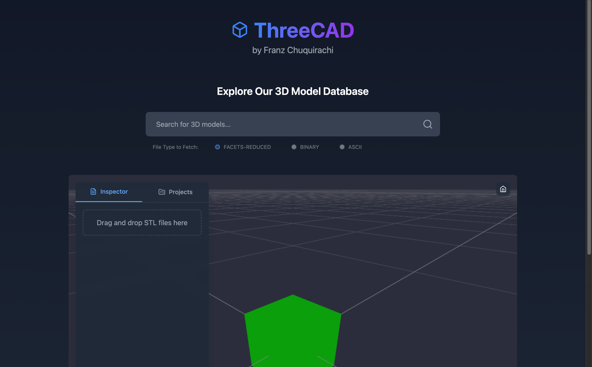
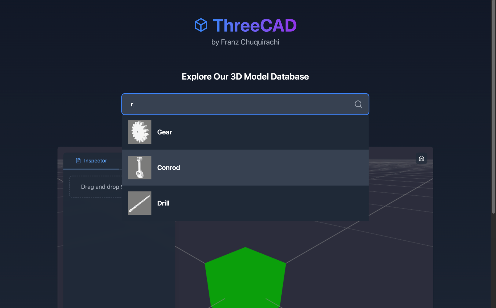
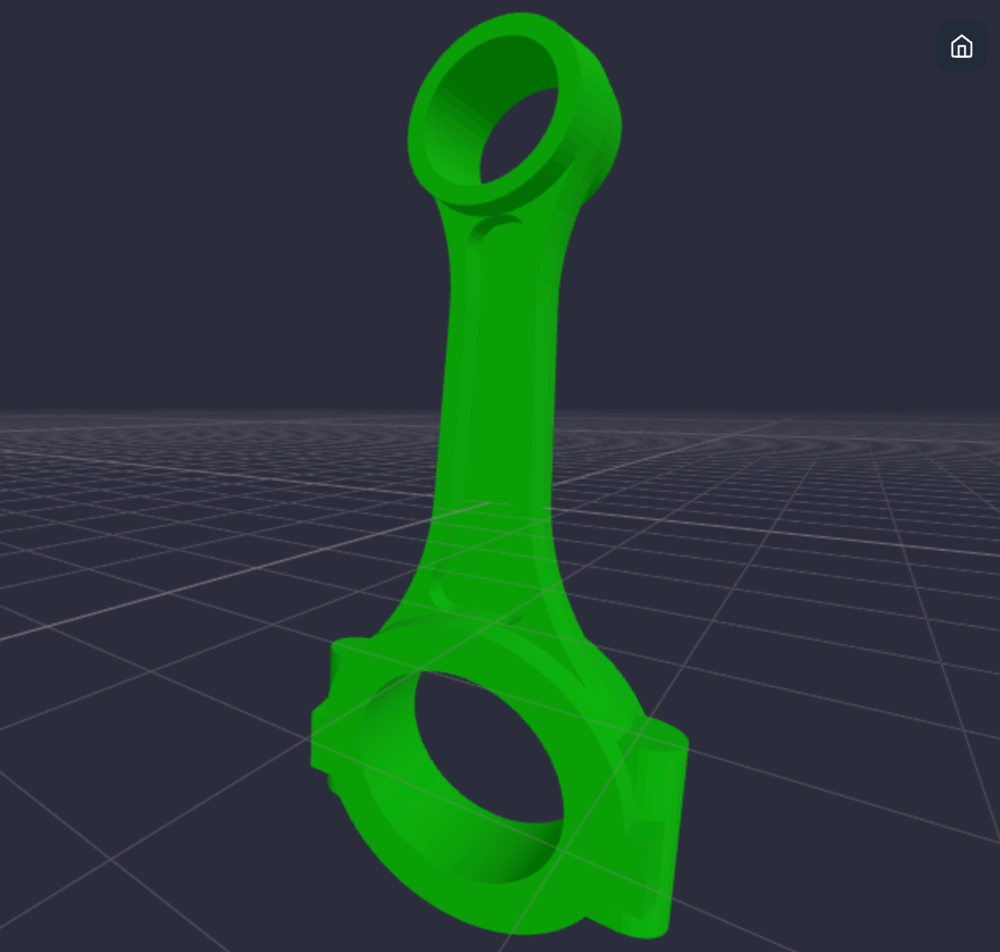
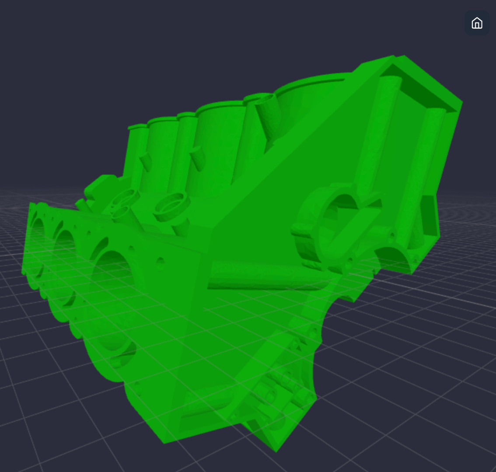
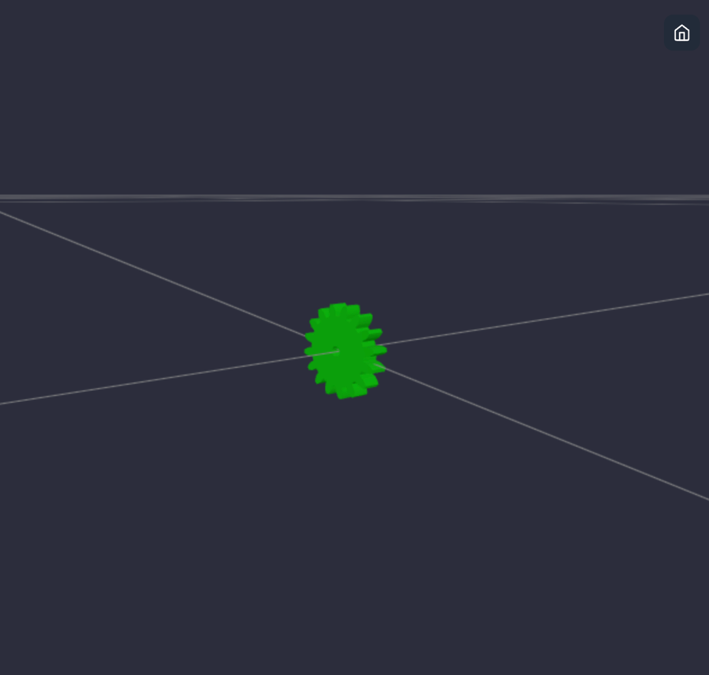
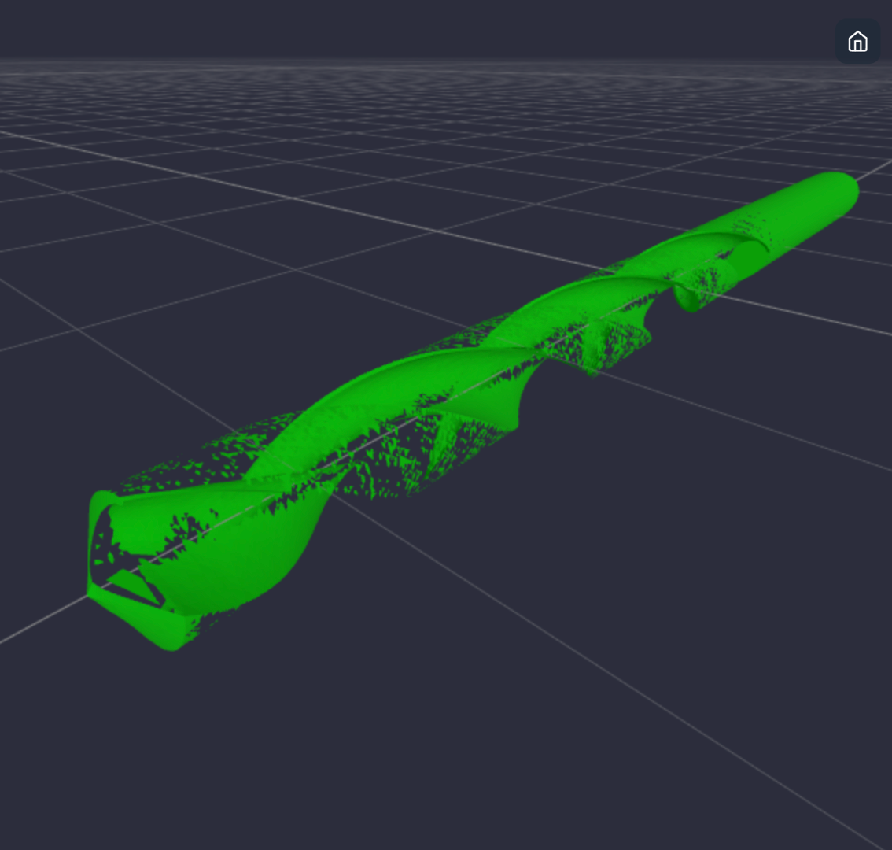

# ThreeCAD

ThreeCAD is an exercise project whose concept is of a light web-based 3D CAD software with objects import from a server or the local computer. This project was done utilizing Typescript and React for the Frontend and Python for the Backend, with the purpose of practicing and exploring:
- User interface design
- User interface development with React
- CSS Styling with Tailwind
- Use of Three.js to handle 3D objects and scenes in the interface
- Asynchronous communication with server endpoints
- Handling client requests of search and file fetching from the server 
- File processing with isolated python programs

And specially, for the purpose of proposing solutions for reducing the costs of transferring large STL files from a server to an interface. Find below the Introduction of the problem and the Cost reduction techniques.

## Description of Customer Journey in the Implemented App

When the customer visualize the application interface will scroll down to interact with the rendered 3D scene. The sample box that is loaded in the scene invites the user to interact with the 3D scene using the cursor. After trying out the natural control of the 3D scene with the cursor and exploring the avaiable buttons in the interface, the user will try to search for models in the 'database' by using the Search box. Information of available 3D models based on the inserted query will be displayed and the user will click on the model of its preference. The server will transfer the selected model file to the interface, and next it will be displayed in the 3D scene, replacing the previous model. The user will notice that different type of files could be fetched from the server and will try each of the options. The user will notice the difference in the files by watching the Fetch time displayed on the bottom right of the 3D scene. The user will notice that the previously loaded files are accesible at every time from the 'Inspector' Tab and will try to drag and drop STL files to the tab since at the begining it invited the user to do so. When the file is dropped, the file characteristics are verified and the results are displayed. In this case, all processes do not communicate with the server. In case the file has a correct format, the 3d object will be loaded on the scene replacing the previous model. The user will keep adding more models through any of the available methods. 

<p style="display: flex; justify-content: center; margin: 0;">
  
  
</p>

## Local Machine Setup and Execution

### Prerequisites

- **Node.js v21 or higher**  
  Install globally on your computer from [Node.js Downloads](https://nodejs.org/en/download/package-manager). Verify the installation by running this in a terminal:
   ```bash
   node -v
   npm -v
   ```

- **Python v3.8 or higher**  
  Create a Python environment using [Conda](https://docs.conda.io/projects/conda/en/stable/) or [Pyenv](https://github.com/pyenv/pyenv). Verify the python version by running this in a terminal:
   ```bash
   python -V
   ```

- **pip**  
  Python package manager included with Python, but verify the installation by running this in a terminal:
   ```bash
   pip -V
   ```  
### Installation Steps

1. Open a terminal window and navigate to the directory where you want to save this repository.
   ```bash
   cd 'YOUR_FOLDER'
   ```

2. Clone this repository:
   ```bash
   git clone https://github.com/franzcrs/threecad.git
   ```
   
3. Navigate to the repository folder:
   ```bash
   cd threecad
   ```

4. Install frontend dependencies:
   ```bash
   npm install
   ```

5. Install Python dependencies. Ensure you have activated your Python environment:
   ```bash
   pip install -r requirements.txt
   ```
### Application Execution Steps 

1. Open a terminal window and start the Python backend server:
   ```bash
   python server/server.py
   ```

2. Open a new terminal and start the frontend development server:
   ```bash
   npm run dev
   ```

3. In the last terminal, insert the letter `o`+`Enter` to open the browser and navigate to the frontend URL (http://127.0.0.1:3000):
   ```bash
   o
   ```
   
4. Use the web application

## Introduction to the problem

Loading large STL files from a server to a client web app can be costly due to a variety of demands.

- **Communication**:
  From the communication side, the cost of loading large files from a server lies in the bandwidth demands of the network and the server’s output, specifications which impacts the travel time of requests and responses. If large STL files are attempted to be fetched when the user and server internet service bandwidths are limited, the data transfer times can become slow and lead to increased latency, making the user experience less responsive. To make transfer times faster, it is necessary to invest in optimizing both server-side and client-side communication elements, such as changing communication protocols (e.g., using Content Delivery Networks) or implementing infrastructure and network upgrades.

- **Computation**:
  Computation costs lie in the data compression and decompression techniques, as well as in the parsing and rendering processes on the client side. Additionally, the STL file length and format directly affect computation costs. For example, an ASCII format file takes more time to parse than a binary format STL file. Furthermore, the higher the volume of polygons contained in the model, the longer it takes to render. To reduce computation times, developing communication strategies as well as compression techniques are requiered.

- **Resources**:
  Handling large STL files on the client side demands considerable memory for parsing and rendering, which can strain the device. In environments with limited memory, this high usage might result in browser slowdowns or even cause the application to crash. To ensure smooth handling of large STL files, investing in devices with higher specifications is necessary.

Addressing the issue of the **Computation costs**, this project proposes a technique to reduce computation times in the transfer of STL files from server to client. 

## Reduction technique and computation costs

First, reference values of the transfer times from the server and loading (to the 3D scene) times were registered for each of the provided STL models:

**Computation times requesting ASCII STL files with no reduction technique**
<table>
  <tr>
    <td></td><td colspan="3" align="center"><b>Trial 1</b></td>
    <td colspan="3" align="center"><b>Trial 2</b></td>
  </tr>
  <tr>
    <th>STL Model</th><th>Transfer Time (s)</th><th>Loading Time (s)</th><th>Total Time (s)</th>
    <th>Transfer Time (s)</th><th>Loading Time (s)</th><th>Total Time (s)</th>
    <th>Avg. Transfer Time (s)</th>
    <th>File size (MB)</th>
  </tr>
  <tr>
    <td>conrod.stl</td><td>24</td><td>3</td><td><b>27</b></td>
    <td>25</td><td>6</td><td><b>31</b></td>
    <td><b>24.5</b></td>
    <td><b>20</b></td>
  </tr>
  <tr>
    <td>v6engine.stl</td><td>28</td><td>3</td><td><b>31</b></td>
    <td>29</td><td>2</td><td><b>31</b></td>
    <td><b>28.5</b></td>
    <td><b>24.1</b></td>
  </tr>
  <tr>
    <td>gear.stl</td><td>38</td><td>3</td><td><b>41</b></td>
    <td>37</td><td>3</td><td><b>40</b></td>
    <td><b>37.5</b></td>
    <td><b>37.6</b></td>
  </tr>
  <tr>
    <td>drill.stl</td><td>40</td><td>3</td><td><b>43</b></td>
    <td>39</td><td>2</td><td><b>41</b></td>
    <td><b>39.5</b></td>
    <td><b>41</b></td>
  </tr>
</table>

Two computation costs reduction techniques are proposed. The first is the conversion of STL files from ASCII format to binary format. These conversion was performed by running the python script `./server/binaryStl.py` storing the resulting files in the `./server/models/binary` directory. The resulting files had less size than the ASCII format files, which had a necesarry impact in the files transfer times. In the client side, the fetch called after the selection of a model from the Search box, was changed to point to the endpoint of the binary file. The registered transfer and loading times were registered for each of the stored STL models:

**Computation times requesting converted binary STL files**
<table>
  <tr>
    <td></td><td colspan="3" align="center"><b>Trial 1</b></td>
    <td colspan="3" align="center"><b>Trial 2</b></td>
  </tr>
  <tr>
    <th>STL Model</th><th>Transfer Time (s)</th><th>Loading Time (s)</th><th>Total Time (s)</th>
    <th>Transfer Time (s)</th><th>Loading Time (s)</th><th>Total Time (s)</th>
    <th>Avg. Transfer Time (s)</th>
    <th>File size (MB)</th>
  </tr>
  <tr>
    <td>conrod.stl</td><td>17</td><td>4</td><td><b>21</b></td>
    <td>10</td><td>4</td><td><b>14</b></td>
    <td><b>13.5</b></td>
    <td><b>3.8</b></td>
  </tr>
  <tr>
    <td>v6engine.stl</td><td>19</td><td>3</td><td><b>22</b></td>
    <td>11</td><td>2</td><td><b>13</b></td>
    <td><b>15</b></td>
    <td><b>4.1</b></td>
  </tr>
  <tr>
    <td>gear.stl</td><td>15</td><td>2</td><td><b>17</b></td>
    <td>16</td><td>3</td><td><b>19</b></td>
    <td><b>15.5</b></td>
    <td><b>6.7</b></td>
  </tr>
  <tr>
    <td>drill.stl</td><td>18</td><td>3</td><td><b>21</b></td>
    <td>14</td><td>5</td><td><b>19</b></td>
    <td><b>16</b></td>
    <td><b>7.2</b></td>
  </tr>
</table>

Reduction rates in transfer times and file size:

<table>
  <tr>
    <th></th><th>conrod.stl</th><th>v6engine.stl</th><th>gear.stl</th><th>drill.stl</th><th>Average</th>
  </tr>
  <tr>
    <td>Transfer times reduction(%)</td><td>-44.89</td><td>-47.36</td><td>-58.67</td><td>-59.49</td><td><b>-52.60</b></td>
  </tr>
  <tr>
    <td>File size reduction(%)</td><td>-81</td><td>-82.98</td><td>-82.18</td><td>-82.43</td><td><b>-82.15</b></td>
  </tr>
</table>

This technique produced an average reduction of 52.6% in transfer times and 82.15% in file sizes, compared to the models in ASCII format.

The second reduction technique consists on the reduction in the number of facets in the 3D object. This transformation technique was performed by running the python script `./server/reduceStl.py` with `reduction_fraction = 0.2`, storing the new 3D objects in both binary and ASCII format. The binary format of the reduced objects were stored in the `./server/models/binary` directory by appending a `_r` at the end of the file name. The ASCII format of the reduced object was stored in the original `./server/models` directory by appending the same string to the file name. Within the two, the binary object was the file to transfer since they had an even smaller size than the complete binary version, while the ASCII format file was used to verify the reduction in the number of facets. When inspected, the number of lines decreased noticeably. In the client side, the fetch called after the selection of a model from the Search box, was changed to point to the endpoint of the facets-reduced binary file whose name ends with `_r.stl`. The registered transfer and loading times were registered for each of the stored STL models:

**Computation times requesting facets-reduced binary STL files**
<table>
  <tr>
    <td></td><td colspan="3" align="center"><b>Trial 1</b></td>
    <td colspan="3" align="center"><b>Trial 2</b></td>
  </tr>
  <tr>
    <th>STL Model</th><th>Transfer Time (s)</th><th>Loading Time (s)</th><th>Total Time (s)</th>
    <th>Transfer Time (s)</th><th>Loading Time (s)</th><th>Total Time (s)</th>
    <th>Avg. Transfer Time (s)</th>
    <th>File size (MB)</th>
  </tr>
  <tr>
    <td>conrod.stl</td><td>14</td><td>4</td><td><b>18</b></td>
    <td>10</td><td>5</td><td><b>15</b></td>
    <td><b>12</b></td>
    <td><b>3</b></td>
  </tr>
  <tr>
    <td>v6engine.stl</td><td>9</td><td>1</td><td><b>10</b></td>
    <td>9</td><td>2</td><td><b>11</b></td>
    <td><b>9</b></td>
    <td><b>3.3</b></td>
  </tr>
  <tr>
    <td>gear.stl</td><td>18</td><td>4</td><td><b>22</b></td>
    <td>13</td><td>3</td><td><b>16</b></td>
    <td><b>15.5</b></td>
    <td><b>5.3</b></td>
  </tr>
  <tr>
    <td>drill.stl</td><td>10</td><td>3</td><td><b>13</b></td>
    <td>15</td><td>3</td><td><b>18</b></td>
    <td><b>12.5</b></td>
    <td><b>5.7</b></td>
  </tr>
</table>

Reduction rates in transfer times:

<table>
  <tr>
    <th></th><th>conrod.stl</th><th>v6engine.stl</th><th>gear.stl</th><th>drill.stl</th><th>Average</th>
  </tr>
  <tr>
    <td>Transfer times reduction(%)</td><td>-51.02</td><td>-68.42</td><td>-58.67</td><td>-68.35</td><td><b>-61.62</b></td>
  </tr>
  <tr>
    <td>File size reduction(%)</td><td>-85</td><td>-86.31</td><td>-85.90</td><td>-86.10</td><td><b>-85.83</b></td>
  </tr>
</table>

The second technique produced an average reduction of 61.62% in transfer times and 85.83% in file sizes, compared to the models in ASCII format. 

Quantitatively speaking the second technique had better reduction in computation costs (See the summary table below). However, qualitatively speaking the appeareance of some models appear broken. Since the program `./server/reduceStl.py` reduces the facets with no discrimination of breaking surfaces of the model, this side-effect can happen. An example of this is noticeable in the model `drill.stl`. But, even a problem of such have solutions. **Work-around A** consists on first loading the facets-reduced binary file for the first instants exclusively, since this satisfy the user needs of uninterrupted workflow. While successfully giving the illusion of fast fetching of models from a server, the facet-complete binary file will be requested and loaded in place of the previous model. **Work-around B** consists of erasing the facet-reduced object whose surfaces are broken and redirect the file fetching to the facet-complete binary file.

**Summary Table**
<table>
  <tr>
    <th></th><th></th><th>conrod.stl</th><th>v6engine.stl</th><th>gear.stl</th><th>drill.stl</th>
  </tr>
  <tr>
    <td rowspan="2">Converting to binary</td><td>Transfer times reduction(%)</td><td>-44.89</td><td>-47.36</td><td>-58.67</td><td>-59.49</td>
  </tr>
  <tr>
    <td>File size reduction(%)</td><td>-81</td><td>-82.98</td><td>-82.18</td><td>-82.43</td>
  </tr>
  <tr>
    <td rowspan="2">Reducing facets + converting to binary</td><td>Transfer times reduction(%)</td><td>-51.02</td><td>-68.42</td><td>-58.67</td><td>-68.35</td>
  </tr>
  <tr>
    <td>File size reduction(%)</td><td>-85</td><td>-86.31</td><td>-85.90</td><td>-86.10</td>
  </tr>
  <tr>
    <td colspan="2">Facets-reduced model quality (Critical factor)</td>
    <td></td>
    <td></td>
    <td></td>
    <td></td>
  </tr>
</table>

By watching the summary table we can notice that even if the facets-reduced binary is disabled, the complete binary file still have competitive cost reductions. Specially, having a reduction in size of the buffered file in the client without having an impact in the model quality, means that the model can be direclty inspected and used by the user, and alleviating the load of handling the object in the 3D visualizer.

Therefore, the work-around B was implemented. In consequence the facets-reduced version of the binary file of `drill.stl` was moved to another folder and the default type of file that is requested is set to the facets-reduced binary option. In the UI, unique-option (radio) buttons corresponding to the type of file to fetch are added for the the user to test and inspect. Only in the case of the drill object, the facets-reduced binary file is replaced by the complete binary file.

## Development Decisions

### Frontend

It was decided to leverage specific packages and development technologies instead of using plain JavaScript or TypeScript with WebGL Library for the 3D grahics to reduce implementation time in creating a fast, responsive, and interactive user interface. 
Key development decisions include:

- **Vite**: Chosen as the development tool (framework) for its fast server deployment and instantaneous interface render updates. It also guarantees optimized production builds, eliminating restrictions for continuous program growth.
- **Three.js**: Built on top of WebGL. Provides advantages over using WebGL directly due to its built-in functionalities and reduced development process, contributing to a more efficient workflow, ultimately reducing delivery time.
- **React and TypeScript**: Selected for the component-based architecture, enhanced development experience, and guaranteed interface with a competitive user experience.
- **Tailwind CSS**: Enables rapid UI CSS styling, particularly in transition effects.
- **Lucide React**: Provides clean and intuitive icons while maintaining a minimal bundle size.

### Backend

It was decided to build a server using Python and its web framework, **Flask**, as this allows for file manipulation on the server side as well as integration with complex artificial intelligence algorithms and modern AI technologies. For this demo, programs for converting the stl files from ASCII to binary and for reducing the number of facets of the 3D object are included and were run to generate the different type of files available por 3D model. Both programs used the library **Open3D** to handle 3D object files operations swiftly and easily.

## Development Notes

- The backend server runs on http://127.0.0.1:5000
- CORS is enabled for local development
- The frontend server runs on http://127.0.0.1:3000
- Preview images and STL files should be stored in `./server/models`
- Running the program `./server/binaryStl.py` will generate objects binary files in `./server/models/binary` 
- Running the program `./server/reduceStl.py` will generate `_r.stl`-terminated files in `./server/models/binary` in case of binary files and `_r.stl`-terminated files in `./server/models` in case of ASCII files